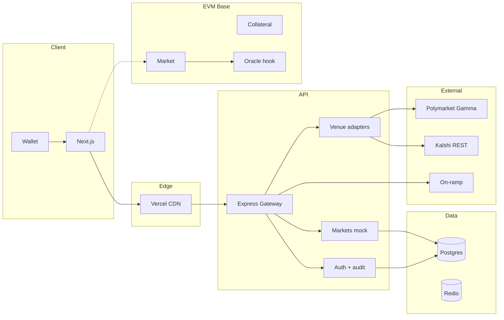

<div align="center">

# QuantumBets

### Trading-terminal prediction markets · SA-first · Global-ready

[](LICENSE)
[](https://nodejs.org)
[](https://nextjs.org)
[](https://soliditylang.org)
[](https://turbo.build)
[](https://base.org)
[](https://postgresql.org)
[](https://docs.docker.com/compose/)

**Event contracts with terminal UX, hybrid oracle, and optional external venue feeds.**

[Linear — start QUANT-28](https://linear.app/quantumbets/issue/QUANT-28) · [Unified plan (doc)](https://linear.app/quantumbets/document/unified-master-plan-v1-canonical-4bf383ae1b08) · [`docs/plans/UNIFIED_MASTER_PLAN.md`](docs/plans/UNIFIED_MASTER_PLAN.md) · [Polymarket API](https://docs.polymarket.com/developers/gamma-markets-api/overview) · [Kalshi API](https://docs.kalshi.com) · [IncryptOracle (reference)](https://github.com/GHX5T-SOL/IncryptOracle)

</div>

---

## Vision

| Pillar | What we ship |
|--------|----------------|
| **Terminal, not casino** | Dense layouts, charts, depth, risk copy — professional trading surface |
| **Local → global** | SA politics, sport, culture first; brand and product not locked to one country |
| **Truth surface** | Hybrid **AI + human** oracle, dispute windows, auditable resolution path |
| **Liquidity bridge** | Read-only **Polymarket** / **Kalshi** aggregation first; cross-venue trading only with counsel + ToS |
| **Crypto rails** | **Base** L2, USDC-style collateral for MVP; custom bridge **after** legal clarity + audits |

### Linear (single track)

- **Start:** **[QUANT-28](https://linear.app/quantumbets/issue/QUANT-28)** — mission, map, sub-issues **S01–S09** (**QUANT-29–37**). Filter **`owner:zoro`** or **`owner:ghost`**. Milestones **U1 → U2 → U3** (ignore legacy **M0–M7** / **Grok P0–P4** for new work).
- **Canonical doc:** [Unified Master Plan v1](https://linear.app/quantumbets/document/unified-master-plan-v1-canonical-4bf383ae1b08) · repo copy [`docs/plans/UNIFIED_MASTER_PLAN.md`](docs/plans/UNIFIED_MASTER_PLAN.md).
- **Grok detail:** [`docs/plans/grok-plan-integration.md`](docs/plans/grok-plan-integration.md) · **ADR:** [`docs/adr/0003-evaluation-solana-vs-base-grok.md`](docs/adr/0003-evaluation-solana-vs-base-grok.md) — **Base (ADR-0001)** default until ADR-0003 spike (**S03 / QUANT-31**) closes.

> **Legal:** Not legal advice. SA gambling is provincial under the [National Gambling Act, 2004](https://www.gov.za/); see [Remote Gambling Bill B11-2024](https://www.gov.za/documents/bills/remote-gambling-bill-b11-2024-16-apr-2024) and [Chambers SA Gaming 2025](https://practiceguides.chambers.com/practice-guides/gaming-law-2025/south-africa). Engage counsel before public money flows.

---

## Monorepo layout

```text
quantumbets/
├── apps/web              # Next.js 14 — terminal UI, marketing shells
├── packages/ui           # Shared UI primitives
├── services/api          # Express + Prisma — auth, markets mock, venue adapters
├── services/oracle       # Off-chain oracle worker + operator HTTP
├── contracts/            # Hardhat — Collateral, Market (Base / Base Sepolia)
├── docs/                 # ADRs, legal intake, security, QA checklists
├── vercel.json           # Vercel monorepo build (Turbo → @quantumbets/web)
├── turbo.json
├── docker-compose.yml    # Postgres 16 + Redis 7
└── package.json          # npm workspaces
```

---

## System architecture



---

## Information architecture (routes)

| Area | Routes |
|------|--------|
| **Public** | `/`, `/markets`, `/venues` (external read-only) |
| **Terminal** | `/terminal` — watchlist + tiles |
| **Instrument** | `/market/[id]` — chart, ticket stub |
| **Ops** | `/admin/oracle` — attestations stub |
| **Planned** | `/portfolio`, `/wallet`, `/legal/*`, `/admin/markets` — see Linear **QUANT-28** / S01–S09 |

---

## Quick start

```bash
git clone https://github.com/GHX5T-SOL/quantumbets.git
cd quantumbets
npm install

# Data layer
docker compose up -d

# API + DB
cd services/api
cp .env.example .env
npx prisma migrate dev
cd ../..

# All dev processes (Turbo)
npm run dev
```

| Service | URL / command |
|---------|----------------|
| **Web** | http://localhost:3000 |
| **API** | http://localhost:4000 · `GET /health` · `GET /api/markets` |
| **Oracle** | `cd services/oracle && npm run dev` → http://localhost:4001 |

**Env (web):** `NEXT_PUBLIC_API_URL=http://localhost:4000` · `NEXT_PUBLIC_ORACLE_URL=http://localhost:4001`

---

## Scripts

| Command | Description |
|---------|-------------|
| `npm run dev` | Turbo dev (web + workspaces) |
| `npm run build` | Production build (all packages) |
| `npm run lint` | Lint |
| `cd contracts && npm run build` | `hardhat compile` |

---

## Vercel

Root [`vercel.json`](vercel.json) installs from the monorepo root and runs:

`npx turbo run build --filter=@quantumbets/web` → output `apps/web/.next`.

**Project settings**

1. Framework Preset: **Next.js** (or Other + custom build).
2. If the dashboard asks for **Root Directory**, try **`.`** (repo root) first with this `vercel.json`.
3. If build fails to detect Next.js, set **Root Directory** to `apps/web` and **Install command** to `cd ../.. && npm install`, **Build command** to `cd ../.. && npx turbo run build --filter=@quantumbets/web`.

**Environment variables (production)**

| Variable | Where |
|----------|--------|
| `NEXT_PUBLIC_API_URL` | Web — API origin |
| `NEXT_PUBLIC_ORACLE_URL` | Web — oracle operator URL (if exposed) |
| `DATABASE_URL` | API (hosted Postgres) |
| `FEATURE_POLYMARKET` / `FEATURE_KALSHI` | API — `false` to disable venue fetches |

---

## Smart contracts (Base)

| Contract | Role |
|----------|------|
| `Collateral` | ERC20 test collateral (`QBTC`) |
| `Market` | Binary market, `buyShares`, `resolve` (oracle), `claimWinnings` |

```bash
cd contracts
npm install
npm run build
npx hardhat run scripts/deploy.ts --network baseSepolia
```

See [`contracts/README.md`](contracts/README.md) and [`docs/adr/0001-default-l2-and-custody-model.md`](docs/adr/0001-default-l2-and-custody-model.md).

---

## Product & engineering on Linear

All **milestones, epics, labels, and day-to-day tasks** live in Linear:

**[QuantumBets Prototype → Overview](https://linear.app/quantumbets/project/quantumbets-prototype-01e0496ea4f9/overview)**

| Milestone | Focus |
|-----------|--------|
| **M0** | Legal intake, incorporation, brand |
| **M1** | Architecture, repo, CI |
| **M2** | Terminal shell + charts |
| **M3** | Internal alpha, mock markets, auth |
| **M4** | Oracle v0 + testnet contracts |
| **M5** | Read-only Polymarket / Kalshi |
| **M6** | Private beta, real collateral testnet |
| **M7** | Audit + mainnet candidate |

**Labels:** `area:frontend` `area:backend` `area:web3` `area:oracle` `area:payments` `area:compliance` `area:design` `area:docs` · `owner:ghost` `owner:zoro` · `phase:P0|P1|P2` · `risk:high`

**PR hygiene:** Put `QUANT-123` in the PR title/body to link GitHub ↔ Linear (see [`.github/PULL_REQUEST_TEMPLATE.md`](.github/PULL_REQUEST_TEMPLATE.md)).

A **Master Plan** document is also attached to the Linear project (vision, roadmap, Ghost vs Zoro split).

---

## Work split (reminder)

| **Ghost** | **Zoro** |
|-----------|----------|
| Monorepo, CI/CD, contracts, oracle, API core | Linear hygiene, brand/Figma, legal scheduling |
| Auth, DB, venue adapters, security | QA checklists, user-facing copy |
| Cursor: long-context refactors, ADRs in `docs/adr/` | ChatGPT/Claude for copy; Perplexity for vendor research |

**Cadence:** Mon planning · Wed oracle/markets sync · Fri demo + retro.

---

## Docs index

| Doc | Purpose |
|-----|---------|
| [`docs/adr/0001-default-l2-and-custody-model.md`](docs/adr/0001-default-l2-and-custody-model.md) | Base, non-custodial MVP |
| [`docs/adr/0002-upgradeability-policy.md`](docs/adr/0002-upgradeability-policy.md) | Proxy / timelock stance |
| [`docs/legal/legal-intake-packet.md`](docs/legal/legal-intake-packet.md) | Counsel packet |
| [`docs/legal/restricted-territories-policy.md`](docs/legal/restricted-territories-policy.md) | Geo policy draft |
| [`docs/security/security-checklist.md`](docs/security/security-checklist.md) | Secrets, auth, audit logging |
| [`docs/security/audit-scope.md`](docs/security/audit-scope.md) | Pre-mainnet audit scope |
| [`docs/qa/`](docs/qa/) | Milestone QA checklists |
| [`docs/plans/grok-plan-integration.md`](docs/plans/grok-plan-integration.md) | Grok plan merged with repo + Linear |
| [`docs/adr/0003-evaluation-solana-vs-base-grok.md`](docs/adr/0003-evaluation-solana-vs-base-grok.md) | Solana vs Base evaluation |

---

## Bootstrap cost snapshot (order of magnitude)

| Line item | Lean range |
|-----------|------------|
| Infra (Vercel, DB, Redis, logs) | $150–800 / mo |
| RPC / indexer | $0–500 / mo |
| LLM (oracle assist) | $50–500 / mo |
| Legal (early) | $5k–30k one-time + ongoing |
| Smart contract audit | $30k–150k+ before mainnet |

---

## Contributing

1. Branch from `main`: `git checkout -b feat/quant-123-short-name`
2. Reference Linear: `QUANT-123` in commits/PRs
3. `npm run build` before PR
4. Request review from CODEOWNERS

---

## Disclaimer

Software is provided **as-is**. Prediction markets may be **restricted or licensable** in your jurisdiction. **Not** legal, tax, or investment advice.

---

<div align="center">

**Built with discipline for real markets**

[Linear](https://linear.app/quantumbets/project/quantumbets-prototype-01e0496ea4f9/overview) · [GitHub](https://github.com/GHX5T-SOL/quantumbets)

</div>
